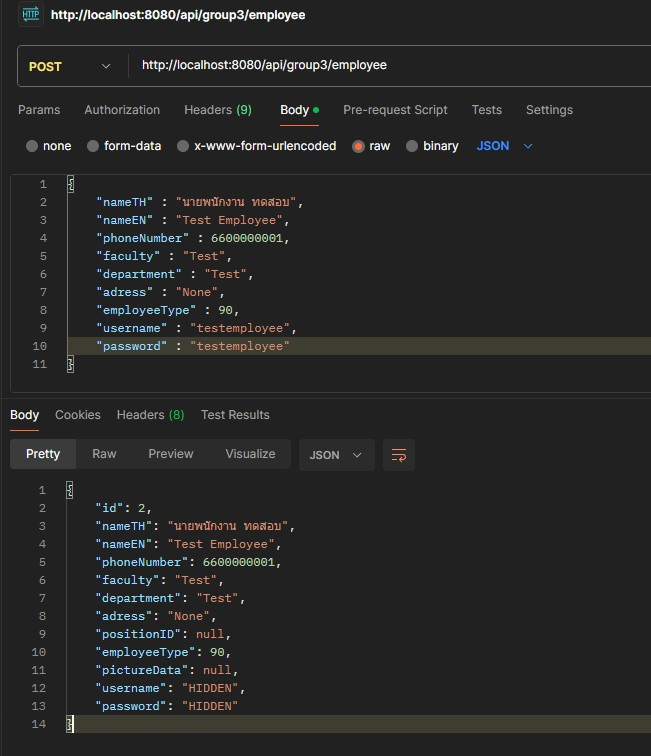
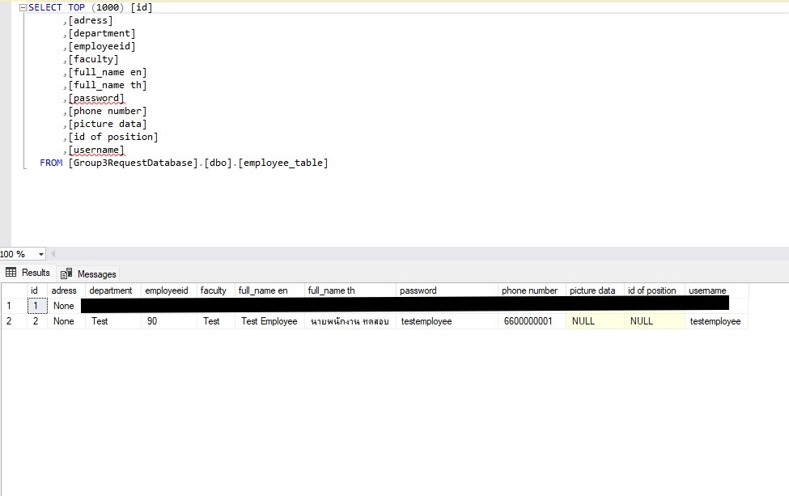
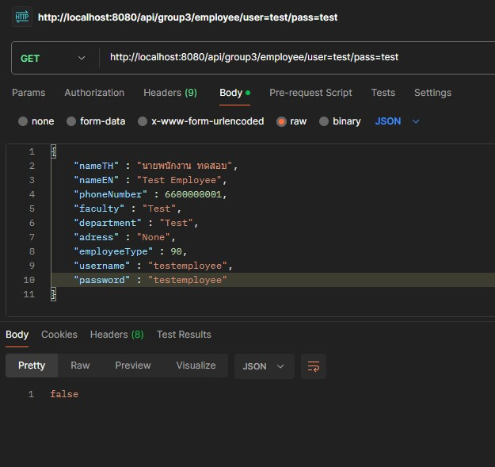
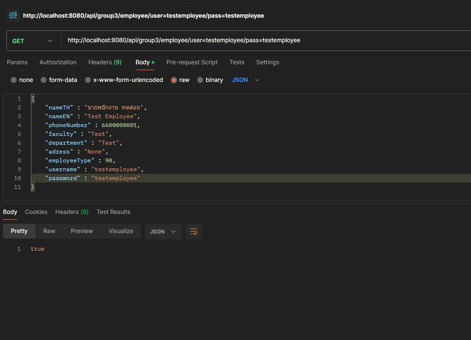

# TU Online Request Backend
## This is a backend development branch that is managing all the database and website data transfers
## Please Note that this is a raw Spring Boot App project so if you want to run on tomcat you need to build your own .war files

---

## Section 1 : DBO Columns Explanation

### Column 1 : Request Table

| Columns Name | Explaination | Comments | Example
|---|---|---|---|
| Id | ID of the dataset that is auto-generated by Spring Boot Apps || 2
| status | Status of the current request | Please Look Section 3 for more info | 200 |
| request type | type of the request | Please Look Section 2 for more info | 4 |
| Username | 10 Digit of TU Student ID || 6609681231 |
| date & time | Date and time of the request at the time that user pressed submit / saved button (System is not save the time when draft code is send) | Seperate by ¶|16¶11¶2022¶15¶36¶49|
| Advisor Name | Name of the Student Advisor || ลัมพาพรรณ พันชูจิตร
| additional request data | Request Data that is coressponding to each type of request | Please Look Section 2 For more info | true¶50000¶เนื่องจากต้องการย้ายสถานศึกษา
| adress | adress of the requestor | this is a combined adress that is seperated in the input field with seperated by ¶ | 4/3 ถนนศรีสุทัศน์¶ตำบลตลาดใหญ่¶อำเภอเมือง¶จังหวัดภูเก็ต|
| base64_file1 | Base64 of the document files | Maximun String Length is 2147483647 (Around 2Giga Character + MAX 2 bytes char non Unicode)
| base64_file2 | Base64 of the document files | Maximun String Length is 2147483647 (Around 2Giga Character + MAX 2 bytes char non Unicode)
| base64_file3 | Base64 of the document files | Maximun String Length is 2147483647 (Around 2Giga Character + MAX 2 bytes char non Unicode)
| base64_file4 | Base64 of the document files | Maximun String Length is 2147483647 (Around 2Giga Character + MAX 2 bytes char non Unicode)

* Note : base64_file1-4 is not sent base64 data when called list of request to avoid unnessary data transfer and filling the ram of the cilent machine. To retrived data please look at the section 5 for more info

### Column 2 : Employee Table
| Columns Name | Explaination | Comments | Example
|---|---|---|---|
| FullName_TH | Fullname of employee in Thai Language | This column is use exclusively to compare name | ลัมพาพรรณ พันชูจิต
| FullName_EN | Fullname of employee in English Language || Lamphaphan Phanchuchit
| Phone Number | 9 - 10 digits Phone number | Phone Number must be number only (No - in any digits)|012345698
| Faculty | Thai Faculty Name | Faculty can be anything like PSM, TULiB| คณะวิทยาศาสตร์และเทคโนโลยี
| Department | Thai sub-faculty name || สาขาวิทยาการคอมพิวเตอร์
| Adress | Adress of that employee seperate by ¶ | Please Look at section ... for more info| 99 หมู่ 18 ถ.พหลโยธิน¶คลองหนึ่ง¶คลองหลวง¶ปทุมธานี
| Position ID |-| Deprecated||
| Employee Type | Type of the Employee | Please look at section 4 for more info | 10 |


---
## Section 2 : Request Type Explanation
The system can be store every request type data but each request type have their own requirement data. Here is a lookup table of each position of data that store in 1 long text that is seperated by ¶

### Request type in current system
1. จดทะเบียนรายวิชาล่าช่า
2. ถอนรายวิชาล่าช้า
3. จดทะเบียนรายวิชานอกหลักสูตร
4. ลาออก
99. คำร้องอื่น ๆ

### Request Body Form
Example : ทดสอบ1¶ทดสอบ2¶ทดสอบ3 ; ¶ is a seperator chunk of data

| ID | Request | Chunk0 | Chunk1 | Chunk2 | Chunk3 | Chunk4 | Chunk5 | Chunk6 | Chunk7 | Chunk8 | Chunk9 |
|---|---|---|---|---|---|---|---|---|---|---|---|
| 0 | ไม่มีคำร้อง |
| 1 | จดทะเบียนรายวิชาล่าช้า |จำนวนวิชาทั้งหมด|Array of รหัสวิชา|Array of ชื่อวิชา | Array of รหัส Section | Array of ปีหลักสูตร | เหตุผลที่ขอจดรายวิชาล่าช้า |
| 2 | ถอนรายวิชาล่าช้า |จำนวนวิชาทั้งหมด|Array of รหัสวิชา|Array of ชื่อวิชา | Array of รหัส Section| Array of ปีหลักสูตร  | เหตุผลที่ขอถอนรายวิชาล่าช้า |
| 3 | จดทะเบียนรายวิชานอกหลักสูตร |จำนวนวิชาทั้งหมด|Array of รหัสวิชา|Array of ชื่อวิชา | Array of รหัส Section | Array of ปีหลักสูตร | เหตุผลที่ขอจดทะเบียนรายวิชานอกหลักสูตร |
| 4 | ลาออก | Boolene of มีภาระคงค้างหรือไม่ | จำนวนเงินที่คงค้าง (Ignore if Chunck 0 False) | เหตุผลที่ขอลาออก | Boolene of ได้ชำระเงินหรือยัง |
| 99 | คำร้องอื่น ๆ | ชื่อคำร้อง | สิ่งที่จำนงค์ | ระดับความสำคัญ | Array of ชื่อผู้รองรับ |

---
##Section 3 : Request Status Explanation

| ID | Status | Explain | Comment |
| --- | --- | --- | --- |
| 0 | Null Request | Do nothing | |
|-|
| 100 | Request Draft | The requested that is saved from user when user pressed the draft button
|-|
| 200 | Request Save to System Successfully | Request is Saved to system and ready to increment to next code | Next Code : 210
| 201 | Request Save Error | Request Cannot be saved because of the problem |
| 210 | Request Send to Advisor Successfully via Email | | Next Code : 220 If approved, 221 If not approved
| 211 | Request cannot Send to Advisor Email | |
| 220 | Request Approved to Advisor | | Next Code : 230
| 221 | Request Declined by Advisor because not clear request | |
| 230 | Request Send to Faculty Successfully | | Next Code : 240 If approved, 241 if declined
| 240 | Request Approved by Faculty | | Next code : 260
| 241 | Request Decline by Faculty | |
| 250 | Request Send to คณะบดี Successfully |
| 260 | Request Approved by คณะบดี | |Next Code : 270
| 261 | Request Decline by คณะบดี | |
| 270 | Request Send to ฝ่ายที่เกี่ยวข้อง |
| 280 | Request Approved by ฝ่าย | | Next Code : 290
| 290 | Request Done Successfully | |Next Code : 300
| 300 | Request Closed || Next Code : None (Not Increment anymore if require will increment to 400)
| 400 | Request Archive |Archive the old request|

---
## Section 4 : Employee Type
| ID | Type | Explain | Comment |
| --- | --- | --- | --- |
| 10 | อาจารย์ผู้สอน สภาวะปกติ | | เป็นสภาวะปกติของอาจารย์ผู้สอน
| 11 | อาจารย์ผู้สอน ลาออก
| 12 | อาจารย์ผู้สอน ผู้ช่วยพิเศษ
| 30 | เจ้าหน้าที่ ฝ่ายช่างอาคาร
| 31 | เจ้าหน้าที่ ฝ่าย IT
| 32 | เจ้าหน้าที่ ฝ่ายความปลอดภัย
| 33 | เจ้าหน้าที่ฝ่ายเทคนิค
| 50 | โดเมนคณะ
| 90 | ฝ่ายอธิการบดี || ฝ่ายอธิการบดีไม่ได้กำหนดว่าใครเป็นคนอนุมัติ


---
## Section 5 : API Calling
Note :
1. Please set Contype-Type in the http header as application/json
2. There are 2 main methods GET and POST method which is used depending on the type of the sender
3. Every Http Request, there will be every JSON return coressponding to the data that we sending, if the request failed to send, the status return will be 4XX - 5XX
4. If JSON file is returned, storefile1-4 will not have the data in column, only String say that it has data "TRUE" and otherwise "FALSE" because to reduce memory problem and unnessary data


### 5.1 Request Type

1. Store Value to Database

URL : <ins>Domain Name</ins>/api/group3/request

Method : POST

Body :
```
{
  "requestStatus" : $long value Non-Null$,
  "requestType" : $long value Non-Null$,
  "username" : $String Non-Null$,
  "datetimeRequest" : $String Non-Null$,
  "advisorNameTH" : $String Non-Null$,
  "requestData" : $2147483647 MAX long String Nullable$,
  "homeAdress" : $2147483647 MAX long String Nullable$,
  "storefile1" : $2147483647 MaX long String Nullable$,
  "storefile2" : $2147483647 MAX long String Nullable$,
  "storefile3" : $2147483647 MAX long String Nullable$,
  "storefile4" : $2147483647 MAX long String Nullable$
}
```
Return Value : (JSON)
```
{
  "id" : $Hibernate Generated ID$,
  "requestStatus" : $long value Non-Null$,
  "requestType" : $long value Non-Null$,
  "username" : $String Non-Null$,
  "datetimeRequest" : $String Non-Null$,
  "advisorNameTH" : $String Non-Null$,
  "requestData" : $2147483647 MAX long String Nullable$,
  "homeAdress" : $2147483647 MAX long String Nullable$,
  "storefile1" : $2147483647 MAX long String Nullable$,
  "storefile2" : $2147483647 MAX long String Nullable$,
  "storefile3" : $2147483647 MAX long String Nullable$,
  "storefile4" : $2147483647 MAX long String Nullable$
}
```
* Note : For some reason, when send null in storefile1-4. Java is detected that it is null but it will return TRUE to the data (TRUE means there are data ready to pull). To solve the problem. you need to not have "storefile1-4" : "" in the JSON

2. Read All Value that store in database

URL : <ins>Domain Name</ins>/api/group3/request

Method : GET

Body : <i>None</i>

Return Value : (Array of JSON)
```
[
  {
    $JSON Return 1$
  },
  {
    $JSON Return 2$
  },
  ....
  {
    $JSON Return n$
  }

]

```
Note : JSON Return n is the same as return from 5.1 request type 1 except each JSON return represnts the all data rows that in the database

3. Read Only Value with matching RequestType ID

URL : <ins>Domain Name</ins>/api/group3/request/type=<i>long value indicating ID from Section 2</i>

Method : GET

Body : <i>None</i>

Return Value : (Array of JSON)
```
[
  {
    $JSON Return 1$
  },
  {
    $JSON Return 2$
  },
  ....
  {
    $JSON Return n$
  }

]

```
* Note : JSON Return n is the same as return from 5.1 request type 1 except each JSON return represnts the all data rows that match the type in the database

4. Read Only Value with matching RequestStatus ID

URL : <i>Domain Name</i>/api/group3/request/status=<i>long value indicating ID from Section 3</i>

Method : GET

Body : <i>None</i>

Return Value : (Array of JSON)
```
[
  {
    $JSON Return 1$
  },
  {
    $JSON Return 2$
  },
  ....
  {
    $JSON Return n$
  }

]

```
* Note : JSON Return n is the same as return from 5.1 request type 1 except each JSON return represnts the all data rows that match the status in the database

5. Read Only Value with matching ID

URL : <i>Domain Name</i>/api/group3/request/id=<i>long value indicating ID</i>

Method : GET

Body : <i>None</i>

Return Value : (JSON)
```
{
  "id" : $Searched ID$,
  "requestStatus" : $long value Non-Null$,
  "requestType" : $long value Non-Null$,
  "username" : $String Non-Null$,
  "datetimeRequest" : $String Non-Null$,
  "advisorNameTH" : $String Non-Null$,
  "requestData" : $2147483647 MAX long String Nullable$,
  "homeAdress" : $2147483647 MAX long String Nullable$,
  "storefile1" : $2147483647 MAX long String Nullable$,
  "storefile2" : $2147483647 MAX long String Nullable$,
  "storefile3" : $2147483647 MAX long String Nullable$,
  "storefile4" : $2147483647 MAX long String Nullable$
}
```
* Note : If There are non ID that specified, Server will return status 500

6. Change receive status with matching ID

URL : <i>Domain Name</i>/api/group3/request/id=<i>long value indicating ID</i>/status=<i>long value indicating ID from Section 3</i>

Method : GET

Body : <i>None</i>

Return Value : (JSON)
```
{
  "id" : $Searched ID$,
  "requestStatus" : $long value Non-Null that changed by receiving argument$,
  "requestType" : $long value Non-Null$,
  "username" : $String Non-Null$,
  "datetimeRequest" : $String Non-Null$,
  "advisorNameTH" : $String Non-Null$,
  "requestData" : $2147483647 MAX long String Nullable$,
  "homeAdress" : $2147483647 MAX long String Nullable$,
  "storefile1" : $2147483647 MAX long String Nullable$,
  "storefile2" : $2147483647 MAX long String Nullable$,
  "storefile3" : $2147483647 MAX long String Nullable$,
  "storefile4" : $2147483647 MAX long String Nullable$
}
```
* Note : If There are non ID that specified, Server will return status 500

7. Return Number of all table rows

URL : <i>Domain Name</i>/api/group3/request/count

Method : GET

Body : <i>None</i>

Return Value : (Body Raw)
```
$number of elements (rows)$
```

8. Return File Data

URL : <i>Domain Name</i>/api/group3/request/id=<i>long value indicating ID</i>/file=<i>number 1-4 indicating which file do you want it to return</i>

Method : GET

Body : <i>None</i>

Return Value : (Body Raw)
```
$String of base64 data$
```

9. Delete Rows by ID

Method Name: toDeleteID

URL : <i>Domain Name</i>/api/group3/request/deleteid=<i>long ID</i>

Method : GET

Body : <i>None</i>

Return Value : (Body Raw)
```

<i>If there are no ID that specified</i>
$ ID is not found! <br> Cannot Delete! $

<i>If there are ID that specified</i>
$ ID is removed!$
```


90. Test Body Return Data
URL : <i>Domain Name</i>/api/group3/request/testhtml

Method : GET

Body : <i>None</i>

Return Value : (Body Raw)
```
Your String is Working
```

91. Test SMTP Mail Server
URL : <i>Domain Name</i>/api/group3/request/testmail=<i>Your Email to Test Here</i>

Method : GET

Body : <i>None</i>

Return Value : (Body Raw)
```

```

* Note : Please Check your email if there are message 
Header : SMTP Test
Body : This is a test of SMTP Mail Service
It is indicating that mail service is successfully sent


## 5.2 Employee
Note :
1. Please set Contype-Type in the http header as application/json
2. There are 2 main methods GET and POST method which is used depending on the type of the sender
3. Every Http Request, there will be every JSON return coressponding to the data that we sending, if the request failed to send, the status return will be 4XX - 5XX
4. If JSON file is returned, username and password will be "HIDDEN"


1. Store Value to Database

URL : <i>Domain Name</i>/api/group3/employee

Method : POST

Body :
```
{
  "nameTH" : $String Non-Null$,
  "nameEN" : $String Non-Null$,
  "phoneNumber" : $Long value Non-Null$,
  "adress" : $String Non-Null$,
  "positionID" : $Long value Non-Null$,
  "faculty" : $String Non-Null$,
  "employeeType" : $Long value Non-Null$,
  "Picture Data" : $2147483647 MAX long String Nullable$,
  "username" : $String Non-Null Unique$,
  "password" : $String Non-Null$
}
```
Return Value : (JSON)
```
{
  "id" : $Hibernate Generated ID$,
  "nameTH" : $String Non-Null$,
  "nameEN" : $String Non-Null$,
  "phoneNumber" : $Long value Non-Null$,
  "adress" : $String Non-Null$,
  "positionID" : $Long value Non-Null$,
  "faculty" : $String Non-Null$,
  "employeeType" : $Long value Non-Null$
  "Picture Data" : $2147483647 MAX long String Nullable$
  "username" : "HIDDEN",
  "password" : "HIDDEN"
}
```

2. Read All Employee Rows that store in database

URL : <i>Domain Name</i>/api/group3/employee

Method : GET

Body : <i>None</i>

Return Value : (Array of JSON)
```
[
  {
    $JSON Return 1$
  },
  {
    $JSON Return 2$
  },
  ....
  {
    $JSON Return n$
  }

]

```
Note : JSON Return n is the same as return from 5.2 request type 1 except each JSON return represnts the all data rows that in the database

3. Find Employee by nameTH

URL : <i>Domain Name</i>/api/group3/employee/nameTH=<i>Thai name of the employee that you want to search</i>

Method : GET

Body : <i>None</i>

Return Value : (Array of JSON)
```
[
  {
    $JSON Return 1$
  },
  {
    $JSON Return 2$
  },
  ....
  {
    $JSON Return n$
  }

]

```

4. Find Employee by nameEN

URL : <i>Domain Name</i>/api/group3/employee/nameEN=<i>EN name of the employee that you want to search</i>

Method : GET

Body : <i>None</i>

Return Value : (Array of JSON)
```
[
  {
    $JSON Return 1$
  },
  {
    $JSON Return 2$
  },
  ....
  {
    $JSON Return n$
  }

]

```

5. Find Employee that match faculty and nameTH
URL : <i>Domain Name</i>/api/group3/employee/nameTH=<i>TH name of the employee that you want to search</i>/faculty=<i>Faculty of the employee</i>

Method : GET

Body : <i>None</i>

Return Value : (Array of JSON)
```
[
  {
    $JSON Return 1$
  },
  {
    $JSON Return 2$
  },
  ....
  {
    $JSON Return n$
  }

]

```

---

## Section 6 : Example Picture

2. Image of the POST method to add employee



* Note : As you can see, username and password is not shown by default, to avoid leakage of sensitive data


* Now you can see that employee is in the database


* if we search the wrong person. You can see that it return false


* if we search by a newly add user and pass credential. You can see now it return true


###  Protocol Version 1.4.5
### Document Version 1.6.6
